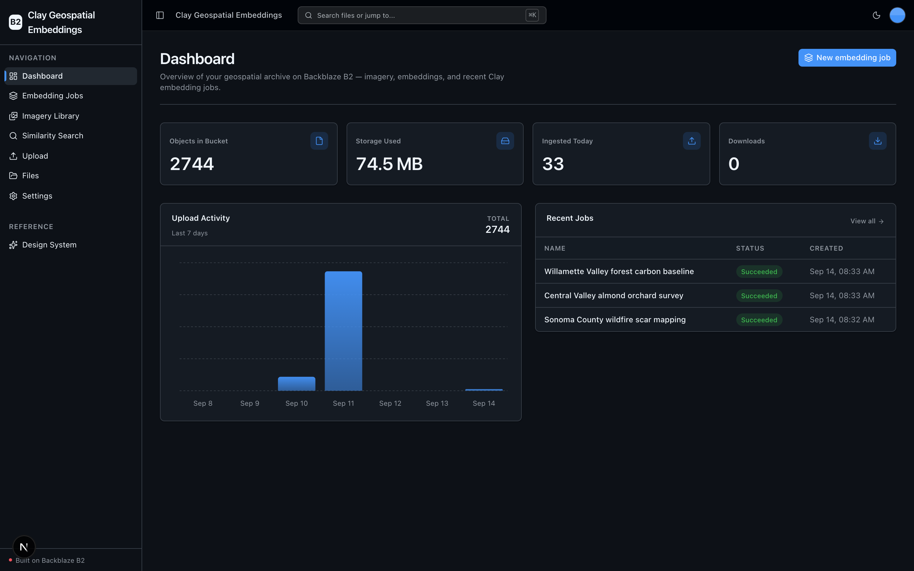
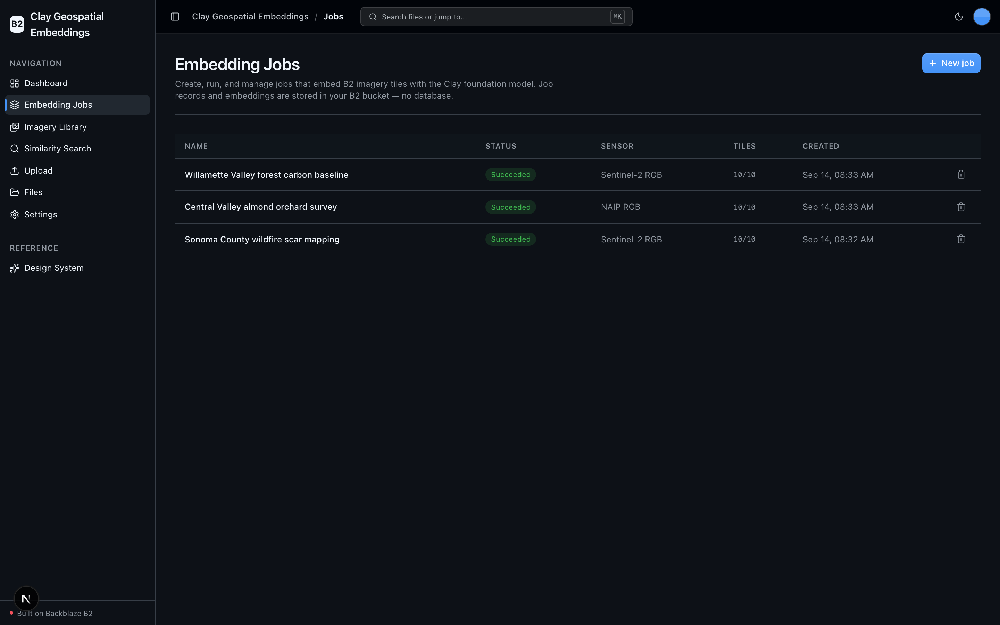
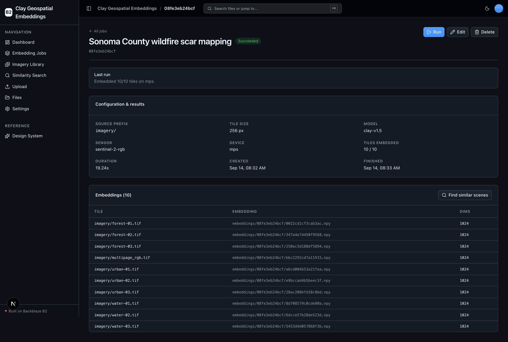
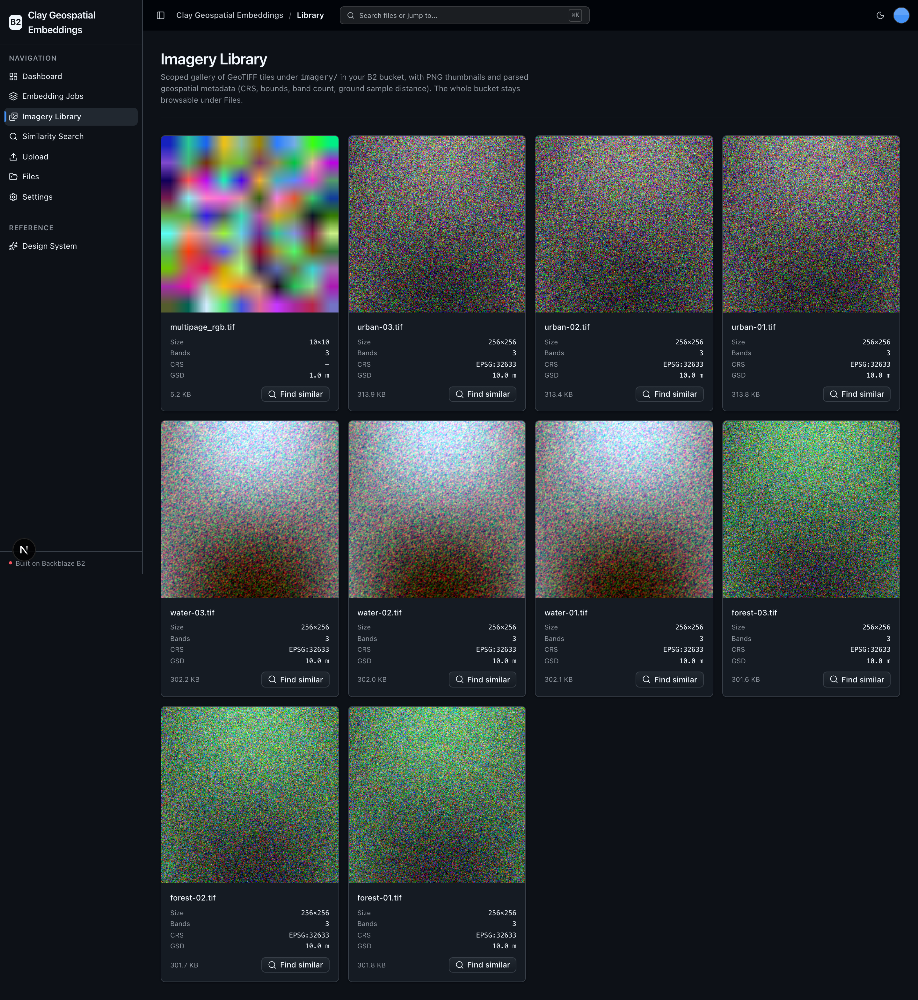
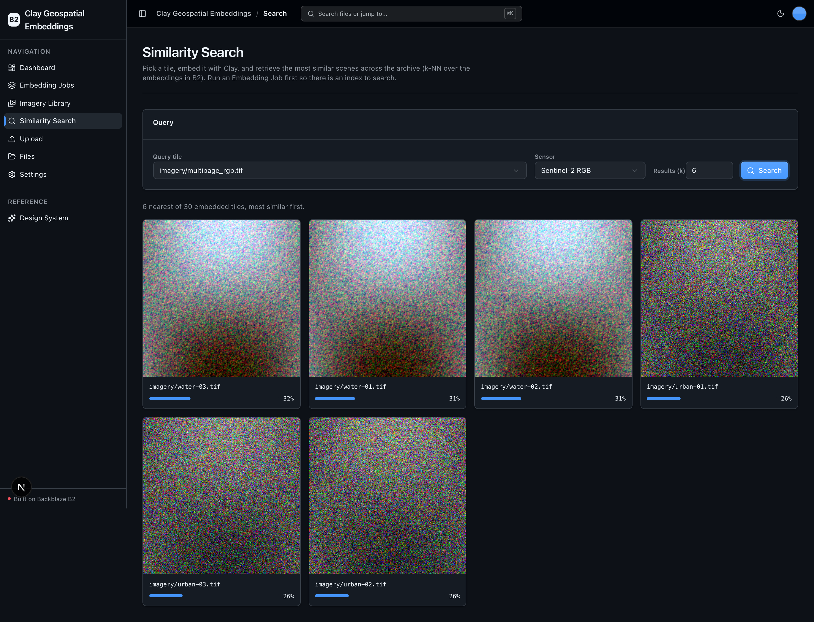

<!-- last_verified: 2026-09-11 -->
# Clay Geospatial Embeddings

Run the [Clay foundation model](https://github.com/Clay-foundation/model) locally
over satellite/aerial imagery stored in **[Backblaze B2](https://www.backblaze.com/sign-up/ai-cloud-storage?utm_source=github&utm_medium=referral&utm_campaign=ai_artifacts&utm_content=b2ai-clay-geospatial-embeddings)**,
write geospatial embedding tensors back to B2, and search the archive for similar
scenes — all on your own hardware, with **B2 credentials only and no second API
key**. B2 is the storage backbone end to end: raw imagery (`imagery/`), normalized
tiles (`tiles/`), embedding artifacts (`embeddings/`), and job records (`jobs/`).

Built for geospatial AI teams — climate-tech, agricultural analytics, government
remote sensing — who need rich semantic embeddings over large imagery archives for
change detection, land-cover classification, and scene retrieval.

**What you get out of the box:**
- **Embedding Jobs** — create, run, edit, and delete named jobs that embed a set of B2 imagery tiles with Clay. Records persist as JSON in B2 (no database).
- **Local Clay embeddings** — Clay's own model runs on-device (autodetect CUDA → Apple MPS → CPU) and writes `.npy` embeddings to B2. $0 per run — local compute only.
- **Imagery Library** — a scoped GeoTIFF gallery over `imagery/` with PNG thumbnails and parsed geospatial metadata (CRS, bounds, bands, GSD).
- **Similarity search** — pick a tile, embed it, and retrieve the nearest scenes with a usearch k-NN index over the embeddings in B2.
- **Full-bucket file browser + direct-to-B2 upload** — the reusable B2 scaffolding, kept from the starter.
- FastAPI backend with a strict layered architecture, structural tests, and agent-optimized docs.

## What it looks like

**Dashboard** — B2 archive overview with object, storage, and ingest stats, a 7-day upload-activity chart, and recent embedding jobs.



**Embedding Jobs** — every Clay embedding job listed with its status, sensor preset, tile count, and creation time.



**Job detail** — one job's run summary, full configuration, and the per-tile embedding artifacts written to B2.



**Imagery Library** — a scoped GeoTIFF gallery over `imagery/` with PNG thumbnails and parsed geospatial metadata (CRS, bounds, bands, GSD).



**Similarity Search** — pick a tile, embed it with Clay, and retrieve the nearest scenes from the B2 embedding index, ranked by similarity score.



## Quick Start

You need: Node.js >= 20, pnpm >= 9, Python >= 3.12, and a free
**[Backblaze B2 account](https://www.backblaze.com/sign-up/ai-cloud-storage?utm_source=github&utm_medium=referral&utm_campaign=ai_artifacts&utm_content=b2ai-clay-geospatial-embeddings)**.
No model API key is needed — Clay runs locally.

### 1. Setup

```bash
pnpm run setup
```

This copies `.env.example` to `.env` (only if missing), installs workspace
dependencies, creates `services/api/.venv`, validates it uses Python 3.12+, and
installs the committed API resolution from `services/api/requirements.lock`.

> Use the `pnpm run` form: `setup` (like `doctor`) is a built-in pnpm command
> before pnpm 11, so bare `pnpm setup` would run pnpm's own command instead.

### 2. Add your B2 credentials

Open `.env` and, from the [Backblaze B2 dashboard](https://secure.backblaze.com/b2_buckets.htm):

1. **Create a bucket** → paste its **Bucket Unique Name** into `B2_BUCKET_NAME`,
   and set `B2_REGION` to the bucket's region slug (e.g. `us-west-004`,
   `us-east-005`). The S3 endpoint is derived from the region — nothing else to set.
2. **Create an application key** with `Read and Write` permission →
   **keyID** into `B2_APPLICATION_KEY_ID` and **applicationKey** into
   `B2_APPLICATION_KEY` (shown once).

> Walkthroughs: [creating a bucket](https://www.backblaze.com/docs/cloud-storage-create-and-manage-buckets) and [creating app keys](https://www.backblaze.com/docs/cloud-storage-create-and-manage-app-keys).

### 3. Install the Clay engine + seed imagery

The heavy, native ML/geospatial stack (torch, `claymodel`, rasterio, usearch) is
**gated** out of the default setup/CI so the base install stays fast and hermetic.
Install it once to run the geospatial features:

```bash
pnpm run setup:ml     # installs services/api/requirements-ml.txt into the venv
pnpm run seed         # generates ~9 synthetic GeoTIFF tiles into imagery/ in B2
```

The seed tiles are synthetic and license-clean (forest / water / urban scenes) so
the full pipeline is reproducible from a fresh clone with no multi-TB download.
Have your own imagery? Upload GeoTIFFs on the **Ingest Imagery** page instead.

### 4. Run it

```bash
pnpm dev
```

Frontend at `localhost:3000`, API at `localhost:8000` (Swagger UI at `/docs`).
Create an **Embedding Job** (Sentinel-2 RGB matches the seed tiles), run it, then
try **Similarity Search**. `pnpm dev` runs the `pnpm run doctor` preflight first.

### Supported local environments

Local scripts run on macOS, Linux, and WSL2 — native Windows isn't supported yet.
Native-ML crashes (partial MPS op coverage on Apple Silicon) are contained
in-repo: an embed that fails on MPS/CUDA is retried on CPU, and a failed run is
recorded with an actionable message rather than taking the API down. See
[docs/verification.md](docs/verification.md#local-environments) for sandbox and
port behavior.

## When to use

Use this as a template or reference when you want to embed a satellite/aerial
imagery archive with a real geospatial foundation model, keep every artifact
(imagery, tiles, embeddings, job records) in your own B2 bucket over the
S3-compatible API, and offer scene-similarity retrieval — starting from a
dependable, tested scaffold instead of a blank prototype.

## When not to use

Don't expect a complete hosted product. It ships no managed hosting, user
accounts, authentication, tenant isolation, billing, or on-call operations, and
the synthetic seed set is a demo — production imagery archives are your own. You
own the security, operations, capacity, and compliance decisions for anything you
adapt.

## Why Backblaze B2?

[Backblaze B2](https://www.backblaze.com/sign-up/ai-cloud-storage?utm_source=github&utm_medium=referral&utm_campaign=ai_artifacts&utm_content=b2ai-clay-geospatial-embeddings)
is the storage this sample is built around, not just a demo backend:

- **S3-compatible API.** B2 speaks the S3 API, so `boto3` and existing S3 tooling
  work unchanged against B2's regional endpoint. All access is isolated in
  `services/api/app/repo/`, so nothing is locked to a proprietary client.
- **Built for data-heavy AI.** Imagery archives and embedding tensors are exactly
  the accumulating, data-heavy workload B2 is priced for, with generous free
  egress to many compute/CDN partners.
- **Free to start.** A free B2 account runs everything here; a full local demo run
  costs $0 in model compute.

## How B2 is used

| Operation | Where | Purpose |
|---|---|---|
| `put_object` | upload, embedding write, job write | imagery→`imagery/`, `.npy`→`embeddings/<job_id>/`, job JSON→`jobs/<id>.json` |
| `get_object` | embed, search, preview | stream GeoTIFF tiles, load `.npy` embeddings |
| `list_objects_v2` | explorer, library, dashboard, index build | browse prefixes, aggregate stats, enumerate embeddings |
| `head_object` | metadata, job read | object metadata |
| `delete_object(s)` | scoped job delete, danger zone | a job deletes only its `embeddings/<job_id>/` + `jobs/<id>.json` |
| `generate_presigned_url` | download/preview + direct upload | signed GET/PUT |

All access uses the **S3-compatible API** (no b2-native), every S3 client sets a
custom user agent (`b2ai-clay-geospatial-embeddings`), and the region-derived
endpoint means no region is hardcoded in source.

## Commands

| Command | What it does |
|---------|-------------|
| `pnpm run setup` | One-time cold start: `.env`, workspace deps, backend venv, locked API deps |
| `pnpm run setup:ml` | Install the gated Clay + geospatial stack (`requirements-ml.txt`) |
| `pnpm run seed` | Generate synthetic GeoTIFF tiles into `imagery/` in B2 |
| `pnpm dev` | Start frontend + backend (runs the `pnpm run doctor` preflight first) |
| `pnpm wait-ready` | Block until web + API answer, then exit — use instead of sleeping |
| `pnpm verify` | Credential-free pre-PR suite: `check:agent-docs`, `verify:api`, `verify:web` |
| `pnpm verify:api` | Backend half: lint, tests, structural boundaries |
| `pnpm verify:web` | Frontend half: lint, unit tests, typecheck + build |
| `pnpm verify:full` | `pnpm verify` plus Playwright E2E (needs a live local stack + Chromium) |
| `pnpm test:verify` | Run throwaway verification specs from `apps/web/e2e/verify/` |
| `pnpm contract:export` / `pnpm contract:check` | Export / verify the FastAPI OpenAPI contract in `docs/api/openapi.json` |
| `pnpm check:agent-docs` | Agent-instruction / doc-drift check (first gate in `pnpm verify`) |

The base `pnpm verify` runs **without** the ML stack — engine modules lazy-import
torch/rasterio, so tests prove the graceful "engine not installed" paths. Full
command reference: [docs/dev-workflows.md](docs/dev-workflows.md#commands).

## Architecture

A pnpm monorepo: Next.js 16 web (`apps/web`), FastAPI backend (`services/api`,
layered `types → config → repo → service → runtime`), shared TS types
(`packages/shared`). The Clay engine lives in `services/api/app/service/clay/`;
all B2 access is confined to `services/api/app/repo/`. See
[ARCHITECTURE.md](ARCHITECTURE.md).

## Documentation Map

| Doc | Purpose |
|-----|---------|
| [AGENTS.md](AGENTS.md) | Agent table of contents — start here |
| [ARCHITECTURE.md](ARCHITECTURE.md) | System layout, layering, data flows |
| [PRODUCT.md](PRODUCT.md) | Product framing and the geospatial pipeline |
| [docs/features/](docs/features/) | Feature docs (jobs, Clay, library, search, GeoTIFF metadata, upload, browser, dashboard, settings) |
| [docs/app-workflows.md](docs/app-workflows.md) | User journeys |
| [docs/dev-workflows.md](docs/dev-workflows.md) | Engineering workflows, command index |
| [docs/verification.md](docs/verification.md) | What each gate checks, and failure recovery |
| [docs/SECURITY.md](docs/SECURITY.md) | Security principles |
| [docs/RELIABILITY.md](docs/RELIABILITY.md) | Reliability expectations |
| [infra/vercel/README.md](infra/vercel/README.md) | Vercel delivery contract |
| [infra/railway/README.md](infra/railway/README.md) | Railway delivery contract |

## FAQ

**What is Clay Geospatial Embeddings?**
A full-stack sample (Next.js 16 + FastAPI) that runs the Clay foundation model
locally over imagery in Backblaze B2, stores the embeddings in B2, and offers
scene-similarity search — with B2 credentials only.

**Does it really use Clay's own model?**
Yes. The headline capability loads Clay v1.5 from HuggingFace `made-with-clay/Clay`
(public weights, no `HF_TOKEN`) and runs it on-device — never a substitute model.

**Do I need a GPU or a second API key?**
No. Device autodetect picks CUDA → Apple MPS → CPU, defaulting to CPU. There is no
external provider and no second key — only B2 credentials.

**Is it free to run?**
Yes. The code is MIT-licensed and Clay runs on your hardware, so a full local demo
run costs $0 in model compute. B2 offers a free account for storage.

**How is data stored?**
Everything lives in one B2 bucket via the S3-compatible API: `imagery/`, `tiles/`,
`embeddings/<job_id>/`, and `jobs/<id>.json`. No database.

**Can I use my own imagery?**
Yes — upload GeoTIFFs on the Ingest Imagery page (they land in `imagery/`), or point
a job's source prefix at your own tiles. The seed script is just a reproducible
starting point.

**Can I use it in production?**
It's a Backblaze-maintained sample. Production use is possible with caution and your
own validation; there is no SLA for the repository software. See
[When not to use](#when-not-to-use).

**Does it work on Windows?**
Local scripts support macOS, Linux, and WSL2. Use WSL2 on Windows.

**Where do I get help?**
Repository defects via [GitHub Issues](https://github.com/backblaze-b2-samples/clay-geospatial-embeddings/issues);
B2 account/billing/API help via [Backblaze Support](https://www.backblaze.com/help).

## Maintenance and support

Backblaze maintains this open-source sample to help developers build geospatial AI
on B2. It is not covered by the Backblaze service level agreement, and no SLA is
provided for the repository software; B2 service commitments are governed
separately by the applicable Backblaze terms.

## License

MIT License — see [LICENSE](LICENSE).
